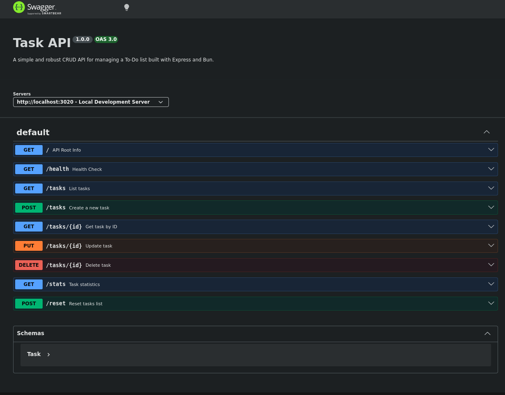

# To-Do List CRUD API

A simple, lightweight, and performant RESTful CRUD API that manages an in-memory To-Do task list. Built using **Express.js** and running on the high-speed **Bun.js** runtime.

Repository: [https://github.com/7amo10/express-bun-crud-api](https://github.com/7amo10/express-bun-crud-api)

---

## [1] Quick Start

### Prerequisites
- [Bun](https://bun.sh) (v1.0.0+) or [Node.js](https://nodejs.org) (v18+)

### Installation & Execution

```bash
# Clone the repository
git clone https://github.com/7amo10/express-bun-crud-api.git
cd express-bun-crud-api

# Install dependencies and start the server
bun install && bun start
```

The server listens on **`http://localhost:3020`**.

To run automated tests:
```bash
bun test
```

---

## [2] API Endpoints Table

| Method | Endpoint | Description | Status Code |
|---|---|---|---|
| `GET` | `/` | API Root Metadata & Endpoints List | `200 OK` |
| `GET` | `/health` | Server Health Status Check | `200 OK` |
| `GET` | `/tasks` | List all tasks (Supports `?done=true/false` & `?search=term`) | `200 OK` |
| `GET` | `/tasks/:id` | Get details of a single task by ID | `200 OK` / `404 Not Found` |
| `POST` | `/tasks` | Create a new task (`{"title": "..."}`) | `201 Created` / `400 Bad Request` |
| `PUT` | `/tasks/:id` | Update task title and/or done state | `200 OK` / `400 Bad Request` / `404 Not Found` |
| `DELETE` | `/tasks/:id` | Delete task by ID | `204 No Content` / `404 Not Found` |
| `GET` | `/stats` | Task metrics (total, done, open counts) | `200 OK` |
| `POST` | `/reset` | Reset task list to initial 3 sample tasks | `200 OK` |
| `GET` | `/docs` | Interactive Swagger UI Documentation | `200 OK` |

---

## [3] Sample `curl -i` Execution Outputs

### Create Task (`POST /tasks`)
```http
$ curl -i -X POST http://localhost:3020/tasks \
  -H "Content-Type: application/json" \
  -d '{"title":"Buy milk"}'

HTTP/1.1 201 Created
X-Powered-By: Express
Content-Type: application/json; charset=utf-8
Content-Length: 43

{
  "id": 4,
  "title": "Buy milk",
  "done": false
}
```

### Invalid Input Validation (`POST /tasks` with empty body)
```http
$ curl -i -X POST http://localhost:3020/tasks \
  -H "Content-Type: application/json" \
  -d '{}'

HTTP/1.1 400 Bad Request
X-Powered-By: Express
Content-Type: application/json; charset=utf-8
Content-Length: 67

{
  "error": "Title is required and must be a non-empty string"
}
```

### Get Non-Existent Task (`GET /tasks/99`)
```http
$ curl -i http://localhost:3020/tasks/99

HTTP/1.1 404 Not Found
X-Powered-By: Express
Content-Type: application/json; charset=utf-8
Content-Length: 29

{
  "error": "Task 99 not found"
}
```

### Delete Task (`DELETE /tasks/4`)
```http
$ curl -i -X DELETE http://localhost:3020/tasks/4

HTTP/1.1 204 No Content
X-Powered-By: Express
```

---

## [4] Interactive Swagger UI Documentation

Interactive API documentation generated using OpenAPI 3.0 specification is served at:
**`http://localhost:3020/docs`**

You can test all CRUD operations directly in your browser using the "Try it out" feature.



---

## [5] The Mortality Experiment

When you create several tasks using `POST /tasks` and then restart the server (`Ctrl+C` followed by `bun start`), performing a `GET /tasks` will show that all newly created tasks are gone and the list resets back to the initial pre-filled array. This occurs because the data lives strictly in server memory (RAM) variables. When the process terminates, all runtime memory allocations are wiped, illustrating why persistent database storage (such as PostgreSQL or SQLite) is essential for real-world backend applications.

---

## [6] Bonus Stage: AI vs Me (The AI Rematch)

### Prompt Given to AI Assistant:
> "Build a minimal To-Do RESTful CRUD API using Express.js and Bun on port 3020. Store tasks in memory with fields id (number), title (string), and done (boolean). Implement GET /, GET /health, GET /tasks, GET /tasks/:id, POST /tasks, PUT /tasks/:id, and DELETE /tasks/:id. Return 201 for POST, 204 for DELETE, 400 for bad input, and 404 with JSON for missing tasks. Include Swagger UI at /docs."

### Comparison & Findings (3 Concrete Differences):

1. **Validation Strictness (HTTP 400)**:
   - **Hand-Built**: Checked for missing titles, non-string types, and whitespace-only strings (`title.trim() === ''`).
   - **AI-Generated**: Only checked `if (!req.body.title)`, allowing empty string `""` or non-string values to slip through.

2. **HTTP 204 Delete Body**:
   - **Hand-Built**: Properly sent an empty response body (`res.status(204).send()`) per RFC HTTP specs.
   - **AI-Generated**: Returned `res.status(204).json({ message: "Deleted" })`, which invalidates the 204 No Content standard by sending a response body.

3. **In-Memory ID Auto-Increment & State Integrity**:
   - **Hand-Built**: Used an explicit counter (`nextId`) ensuring new tasks receive unique sequential IDs even after deletions.
   - **AI-Generated**: Used `tasks.length + 1` for new IDs, causing duplicate IDs when tasks were deleted and new ones were added.

---

## [7] Project Structure

```
Back-Task-1/
├── src/
│   ├── index.js         # Main Express application & routes
│   └── openapi.json     # OpenAPI 3.0 specification
├── test.js              # Automated endpoint test suite
├── package.json         # Project dependencies & scripts
├── .gitignore           # Git ignore rules
└── README.md            # Documentation
```
